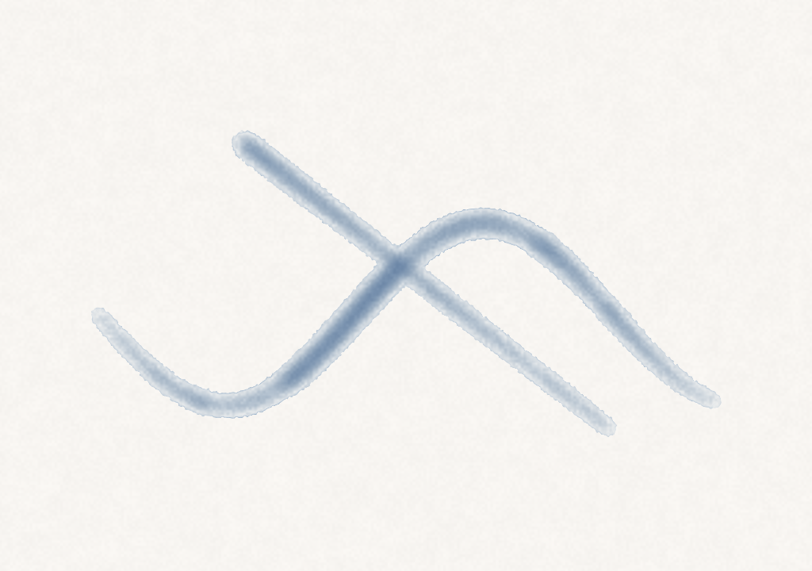
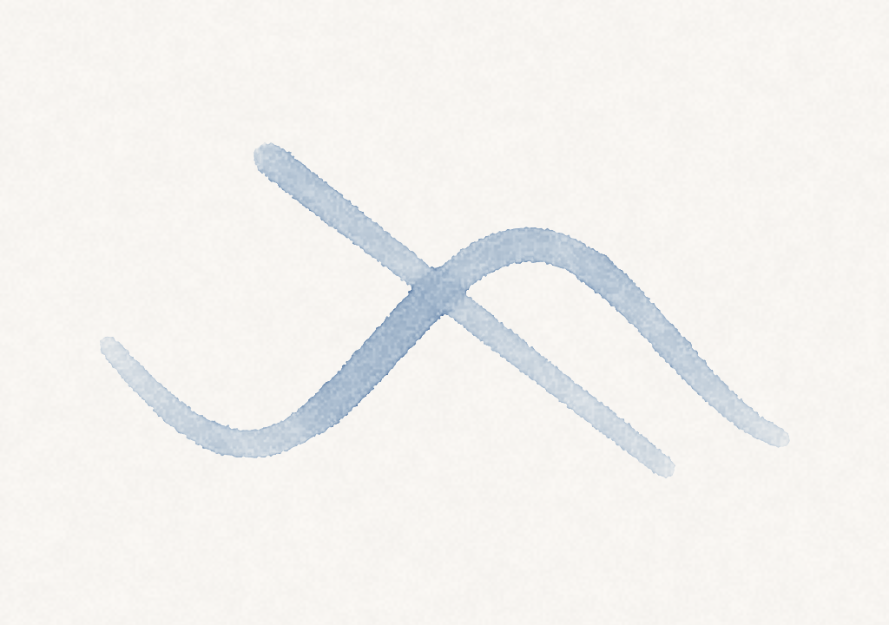
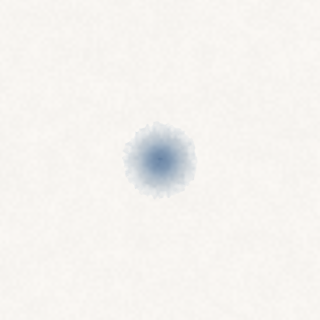
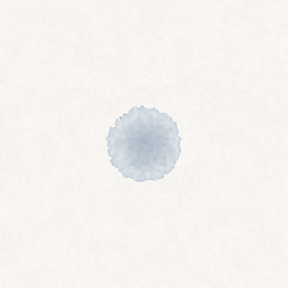

# 2026-06-08 — プロジェクト始動 & M0b 滲みスパイク成功

## やったこと

1. **idea.md を拡充** — コア体験を「リアル画材シミュレーション + ストローク美化のハイブリッド」と定義。プラットフォームは Swift + Metal の macOS ネイティブに決定(自分用 + Swift 経験 + 筆圧/レイテンシ最優先)
2. **入力ハードウェア調査(XPPEN Deco)** — ドライバ必須・標準 NSEvent に筆圧が乗る・開発者 SDK なし(= 標準 NSEvent のみに依存する設計でベンダー非依存に)。タブレットが手元にないため実測(M0a)は保留し、コードだけ先行実装
3. **M0b 滲みスパイク** — Metal compute の滲みシミュレーションをマウス駆動で実装・検証。**ロードマップ最大のリスクを潰した**
4. **xcodegen + xcodebuild 構成へ移行** — SwiftPM 単体から組み替え。シェーダを文字列埋め込みから `Simulation.metal` に移行(コンパイル時にエラーが取れるように)。ディレクトリも Xcode 標準レイアウトに統一

## M0b の結果

| 描いた直後(wet) | 約 5 秒後(dry) |
|---|---|
|  |  |

デモストローク(`make demo`)による自動検証:

- ✅ 筆圧 → 線の表情(中央で膨らみ、端で穂先のように細る/払いは筆圧が抜けて消える)
- ✅ 滲み(時間とともに水が広がり輪郭が柔らかくなる)
- ✅ 乾燥と沈着(蒸発して顔料が紙に定着、淡い水彩トーン)
- ⚠️ エッジダークニングは控えめ → 次のチューニング対象

シミュレーションモデルの詳細は [architecture.md](../architecture.md) 参照。

## 環境・判断の記録

- 開発機: Apple M3 Pro / Metal 4 / Xcode 26.3 / Swift 6.2.4
- Metal ツールチェーンを追加導入(`xcodebuild -downloadComponent MetalToolchain`、約 700MB)
- XPPEN ドライバはインストール済みだが未設定(`com.ugee.PenTablet`)。テスト時はアクセシビリティ + 入力監視の権限付与が必要
- UI デザインツール(Pencil)は不採用に決定 — Bloom は macOS ネイティブ(AppKit)で、Pencil は web/モバイル向けの `.pen` を作るツールのため翻訳ギャップが大きく、コード生成の旨味が出ない。描画アプリの UI は定番レイアウト + 実アプリで判断するのが忠実。M1 の UI は AppKit で素朴に作り、簡単なスケッチで合意してから実装する
- リポジトリ内に残っていた `.build/`(SwiftPM 残骸)と `build/`(DerivedData をリポジトリ内に指定してしまった失敗の残骸)は削除済み。以後のビルド出力はリポジトリ外

## 追記: ブラシ追加とドウェル(置きっぱなし)滲み

同日、手元で触れる状態にするため以下を追加:

- **墨(かすれ)ブラシ + 顔料 2 チャンネル化**(藍 / 墨)。`1`/`2` でブラシ切替、`[`/`]` でサイズ
- **ドウェル供給**: 筆を下ろしている間、動かさなくても毎フレーム水・顔料を継ぎ足す。止めると溜まりが育ち、外へにじむ

### ハマった点と学び(ドウェルの「広がらない」問題)

| 状態 | pooled(溜まり) | dried(乾燥後) |
|---|---|---|
| 調整後 |  |  |

- **「色は濃くなるが広がらない」というフィードバック**から数ラウンド調整。最初は水・顔料・蒸発を色々いじっても広がらず行き詰まった
- **真因は表示スケールの錯覚だった**: 検証キャンバスが 1024×720 と大きく、一点のブルームは実寸では十分広がっていたのに画面比で点に見えていた。`--demo-dwell` のキャンバスを 320×320 に縮めたら、ちゃんと広がっているのが一目で分かった → **デモは「見たいものが画面に占める割合」を意識して作る**
- 広がりを強めようと `flowRate` を 0.28 まで上げたら**チェッカーボード状の数値不安定**が出た。原因は 2D 陽的拡散の安定限界 0.25 超え。**`flowRate < 0.25` を厳守**(architecture.md に明記)
- 知見: **広がり=水、濃さ=顔料**で駆動が分かれている。フィードバックが「広がり」なら水側(`flowRate`/`evapRate`/水上限/`dwellWaterRate`)を動かす
- 最終的に flowRate 0.18 / evapRate 0.0010 / 水上限 8.0 / dwellWaterRate 0.08 で、中心が濃く外へ柔らかくにじむ水彩ブルームに落ち着いた

## 保留中・次のステップ

- **M0a 入力プローブ実測**: XPPEN Deco が手元に戻ったら接続して筆圧・チルト・イベントレートを確認(タイトルバーに `pressure n.nn (tablet/pseudo)` が出る)。チルト対応世代かもここで判明
- **描き味チューニング**: ドウェルの育つ速さ(`dwellWaterRate`)・濃さ(`dwellPigmentRate`)は実際に触って調整。`make demo` / `--demo-dwell` の比較で回す
- **git init**: `.gitignore` は準備済み。Dropbox 配下なので `.git` の同期除外設定とセットで
- **M1**: レイヤー・undo/redo・保存・書き出し。UI は AppKit で素朴に。レイアウトをスケッチで合意 → 実装 → 実アプリで反復
