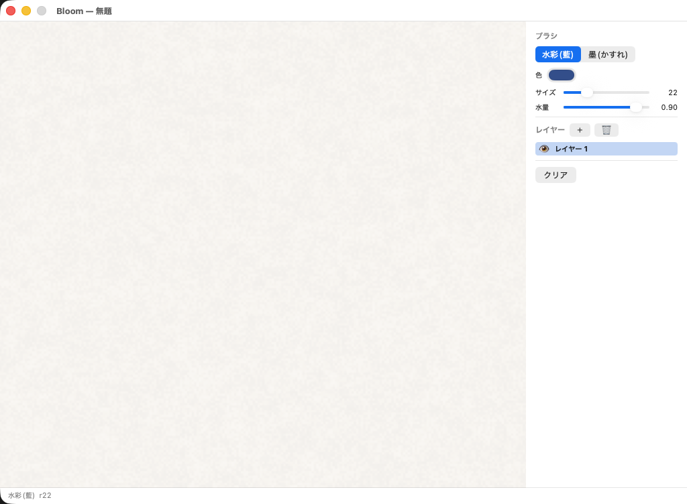
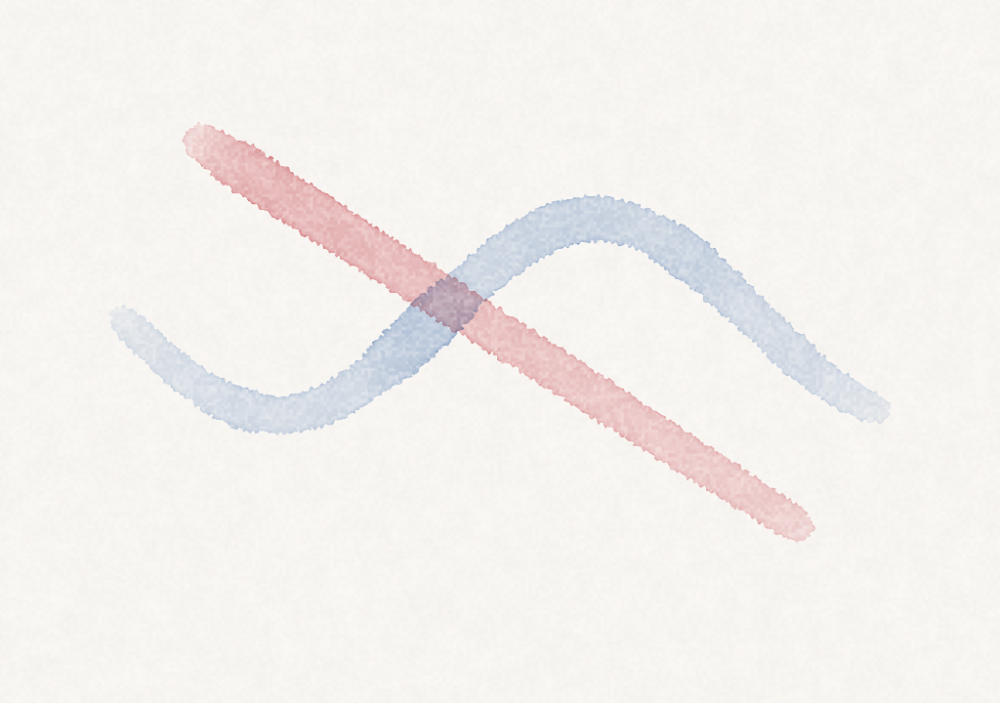

# 2026-06-08 — M1: UI 枠 / 任意色 / レイヤー

M0(シミュレーション)が固まったので、M1(最小ペイントアプリ)に着手。UI 枠 → 色 → レイヤーの順で実装した。

## 決定: UI は AppKit で素朴に(Pencil 不採用)

Pencil(MCP のデザインツール)を使うか相談した結果、不採用に決定。理由: Bloom は macOS ネイティブ(AppKit)で、Pencil は web/モバイル向けの `.pen` を作るツールなのでコード生成の旨味が出ず、翻訳ギャップだけ増える。描画アプリの UI は定番レイアウト + 実アプリで判断するのが忠実。レイアウトは ASCII スケッチで合意 → 実装 → スクショで反復、という流れにした。

## できたもの

- **ウィンドウ構成**: 中央キャンバス + 右インスペクタ + 下ステータスバー(手動フレームレイアウト)。検証モード(`--demo` 系)はキャンバス全面に分岐してスナップショットを汚さない
- **ブラシ設定 GUI**: ブラシ切替・サイズ/水量スライダ。キー操作とスライダは双方向同期
- **任意色選択**: 顔料を float2(藍/墨)→ **float3(RGB 吸光度)** に作り替え。ブラシ色は `K = -ln(color)` で吸光度に変換。カラーウェルで自由に選べる。色が重なると吸光度が加算 = 減法混色
- **レイヤー**: 各層が独自の deposit(float3)を持ち、render で可視層を吸光度加算合成。目アイコンで表示切替、＋/🗑 で追加削除、クリックで選択

（青の波線=層1、赤の払い=層2。重なりが紫=減法混色)

## ハマった点・学び

- **レイヤー検証デモの罠**: 青を描いた直後に `addLayer()` したら、青も層2に乗ってしまった。原因は **ウェット顔料は「乾いた時点でアクティブな層」に沈着する**から(描いた瞬間ではない)。スタンプはキューに溜まり後のフレームで処理されるため。デモは層1が乾くまで待ってから層を追加するよう修正。この仕様自体は妥当(interactive ではストロークを終えてから層を切り替える)なので残す。architecture.md に明記
- **合成は吸光度の和**: Beer-Lambert は透過率の積 = 吸光度の和。可視層の `D` を足して 1 回 `exp` するだけ。重ね順は結果に影響しない(半透明グレーズの近似)。`staticComposite`(可視・非アクティブ層の和)はレイヤー操作時のみ CPU で再構築し、毎フレーム変わるアクティブ層だけ render で別途加算

## テスト・検証

- ユニットテスト 13 件 pass(レイヤー操作 6 件を追加: 追加/削除の最低1枚保証/アクティブ調整/表示切替/選択)
- 検証モード追加: `--demo-layers`(2 層 + 表示切替の PNG)。既存の `--demo` / `--demo-dwell` は維持

## 次

- ⬜ undo/redo(コマンド履歴 — コア API がコマンド志向なので素直に乗るはず)
- ⬜ 保存・書き出し(PNG 書き出しは savePNG があるので UI から叩くだけ。ドキュメント保存はフォーマット要検討)
- ⬜ XPPEN Deco 実測(M0a、タブレットが戻り次第)
