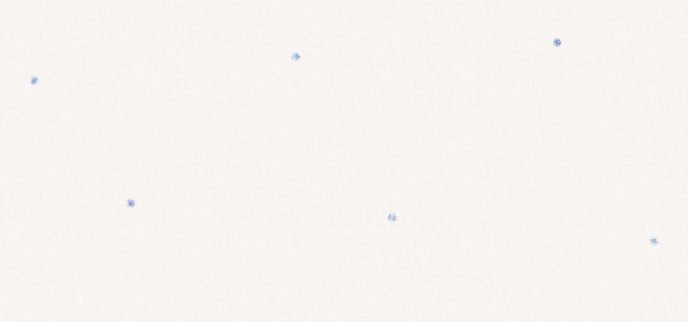
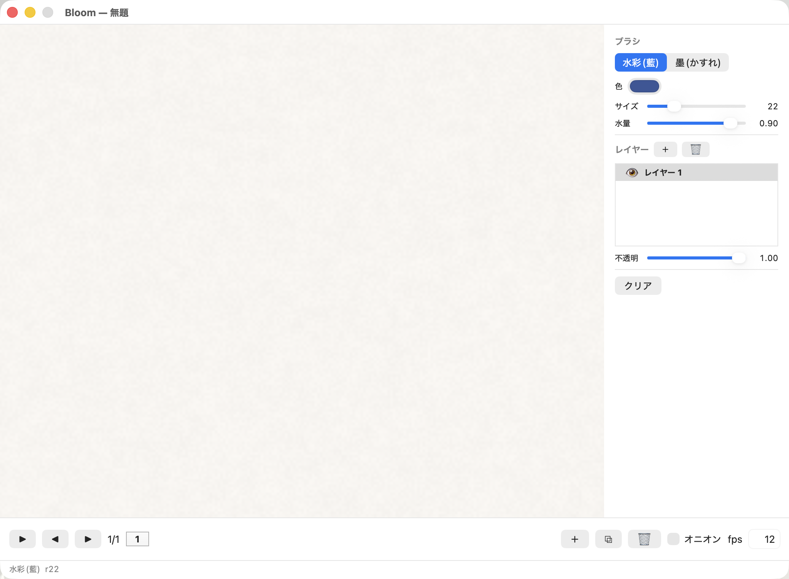

# 2026-06-09 — アニメーション/タイムライン(新 M2, MVP 完了)

高優先の要望: フレームアニメを作って GIF / Unity・Unreal 向け(スプライトシート + PNG 連番)で書き出す。前フレームが薄く見えるオニオンスキン必須。ロードマップに**新 M2** として挿入(美化→M3, MCP→M4, 3D→M5)。feature ブランチ `feature/animation`。

## 設計判断: セル方式(選択肢3)

データ構造を 2 案で議論。当初は「各フレーム独立」を推したが、ユーザーは**背景共有**などプロのアニメ的な理想に近い「セル方式」を選好。M1 直後でレイヤーモデル依存コードがまだ少なく、`.bloom` も未配布なので**今が作り替えの最安タイミング**と判断し、セル方式を採用:

- レイヤー = **トラック(`LayerTrack`)** がフレームをまたいで存在し、各トラックがフレームごとに**セル(`MTLBuffer?`)** を持つ。`cels[f] == nil` は**保持(hold)** = 直前のセルを表示。静止背景はトラックにセル 1 枚を置けば全フレーム共有
- 描画ターゲット = 現フレームのアクティブトラックのセル。保持なら描き始めに自動生成(保持を切って新原画)
- **合成は不変**: 各可視トラックを現フレームの解決後セルに直してから、既存のアフィングレーズ合成にかけるだけ

「動くものを先に」で 3 フェーズ:

## フェーズA — セルコア

`SimulationEngine` の `layers: [Layer]` を `tracks: [LayerTrack]` + セル配列へ作り替え。`frameCount`/`currentFrame`/`activeTrackIndex`、セル解決(hold)、フレーム操作(`addFrame`/`duplicateFrame`/`deleteFrame`/`goToFrame`)。undo をタイムライン全体へ、`.bloom` を **v2**(マルチフレーム、v1 後方互換)へ拡張。

ハマり: `clear()` を init からも呼んでいたので、セル化に合わせ「履歴に積まない内部 zero」と「checkpoint つき公開 clear」を再整理。**既存の単一フレーム挙動(frameCount=1)を壊さないこと**を最優先で確認(全既存テスト + デモが回帰なし)。

## フェーズB — 書き出し

`savePNG` の render→CGImage を `renderFrameCGImage()` に抽出し、`AnimationExport`(extension)で全フレームを回す:
- `exportGIF`(ImageIO の `CGImageDestination` + フレーム遅延/ループ)
- `exportSpriteSheet`(格子 1 枚 PNG + メタ JSON)— Unity/Unreal でスライス可能
- `exportPNGSequence`

検証 `--demo-anim`: ドットが弧を描いて動く 6 フレームを生成 → 書き出し。

## フェーズC — タイムライン UI + オニオン + 再生

- `TimelineView`(下帯): フレーム帯・再生/停止・前後送り・＋複製🗑・オニオン・fps。`AppDelegate` の `playTimer` が fps 間隔で送る。再生中は描画入力を無効化
- **オニオンスキン**: 前フレームの全可視トラックを別アフィン `onionA/onionB` に畳み込み、`renderKernel` で「現フレームが未描画の所に薄く暖色」でブレンド(`onionFactor`)。書き出し時は無効化
- フレームメニュー(新規/複製/削除/前後/再生切替)

 

ハマり: 最初のオニオン検証が「フル表示」になった。原因は `addFrame` が**保持フレーム**を作るため、前フレームがフル表示されていただけ(= 正しい挙動)。オニオンを見るには現フレームを空キーフレーム(`clear`)にする必要があった。

## テスト・検証

- ユニットテスト 37 件 pass(Animation 8 件追加: フレーム操作・hold・保持中描画でセル生成・v2 往復・v1 互換・フレーム undo)
- `--demo-anim`(GIF/スプライト/連番)・`--demo-onion`(ゴースト)で目視確認。既存デモ・スナップショットは回帰なし

## 次

- ⬜ MP4(AVFoundation)・トラック別 fps・hold の 2D グリッド編集(将来)
- 既知: フレーム×セルでメモリ増(hold で節約)、undo 深さは 15 に
- ⬜ M3 美化系 / M4 MCP / M5 3D
