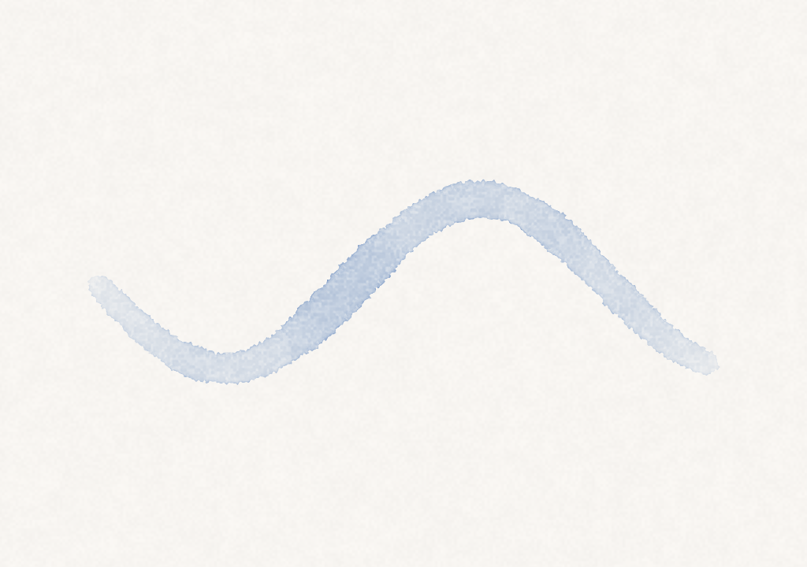

# 2026-06-09 — undo/redo(スナップショット方式)

M1 残りの undo/redo を実装。feature ブランチ `feature/undo-redo` で作業。

## 設計判断: コマンド再生 ではなく スナップショット

Bloom の描画は連続的な流体シミュレーション(滲み・乾燥・沈着)で、ストロークは時間をかけて deposit に染み込む。コマンドを記録して再生する方式だと、フレームごとの substep やドウェルのタイミングまで正確に再現する必要があり脆い。シミュレーションは決定的(乱数・時刻なし)だが、再生は避けて**スナップショット方式**を採用した。

- 取り消し可能な操作の**直前**に `checkpoint()` で全レイヤーの `D`(乾いた絵)+ メタデータを `Data` にコピー
- 取り消し単位: ストローク(`beginStroke`)・`clear`・`addLayer`・`deleteLayer`・`moveLayer`。選択/不透明度/表示切替は積まない(非破壊)
- 復元時に**ウェット(W/P)は破棄**。これで「乾き途中ストロークの redo」という曖昧さを回避できた
- 深さ上限 `maxUndoDepth = 30`

## ハマりどころ

- `clear()` を init からも呼んでいたため、そのまま `checkpoint()` を入れると**起動時に履歴が積まれて**しまう。`zeroWetAndActiveDeposit()`(履歴なし)を切り出し、init はそちら、公開 `clear()` は checkpoint つき、と分けた
- レイヤー操作の `checkpoint()` 位置: 早期 return(削除で最低1枚を守る等)の**後**に置かないと、操作されない無駄な履歴が積まれる

## 検証

| undo 前(描画あり) | undo 後(空に戻る) |
|---|---|
|  |  |

- ストロークの取り消し: `--demo-undo`(描く → 乾かす → before 撮影 → undo → after 撮影)で空に戻ることを確認。レンダリングループを回さないと deposit が起きないので、ユニットではなくスナップショットで検証
- ユニットテスト 25 件 pass(undo 6 件追加: 初期は履歴なし / レイヤー追加の undo+redo / 削除の復元 / 新操作で redo 破棄 / ストロークが取り消し単位 / 深さ上限)
- アプリ: 編集メニュー 取り消す(Cmd+Z)/ やり直す(Cmd+Shift+Z)、`validateMenuItem` で有効化

## 次

- ⬜ 保存・書き出し(M1 残り。PNG 書き出しは `savePNG` があるので UI から。ドキュメント保存はフォーマット要検討)
- ⬜ XPPEN Deco 実測(M0a)
