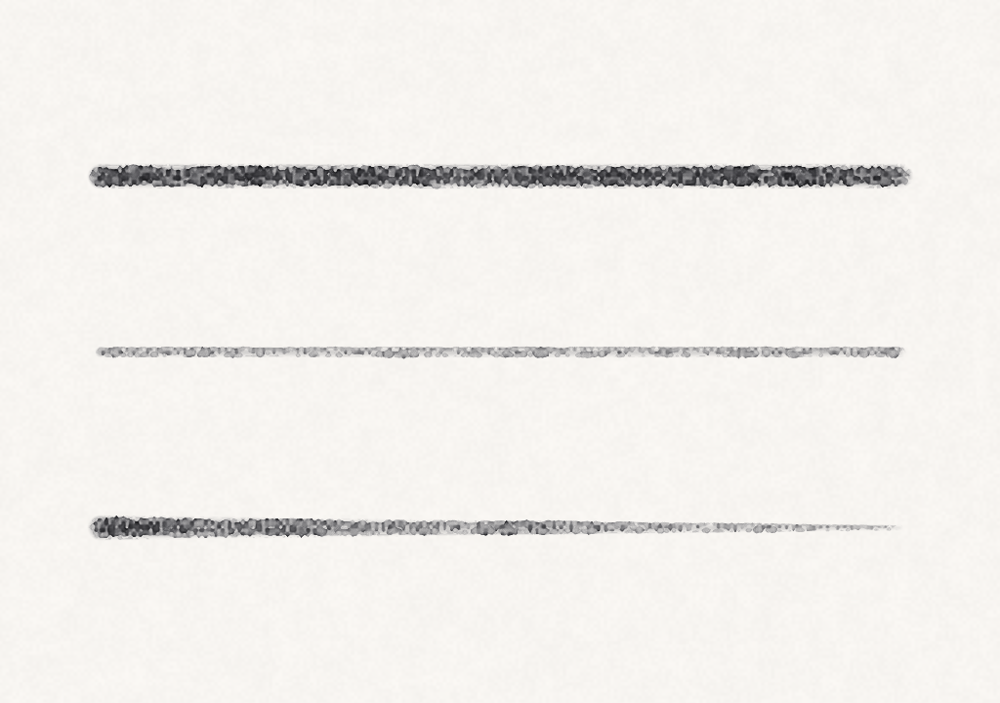

# 2026-06-10 — 墨のかすれブラシの作り込み(M3 美化系・完了)

M3「美化系」の最後の 1 つ、墨のドライブラシ(かすれ)を作り込んだ。feature ブランチ `feature/sumi-drybrush`。
これで M3(マウス擬似筆圧・手ブレ補正・墨のかすれ)が揃った。

## それまでの状態

`stampKernel` には下地があった: `dryness` が高いと紙テクスチャ `H` の凸部にだけ顔料が乗る、という静的なグレインマスク。

```metal
float grainMask = mix(1.0, smoothstep(0.45, 0.62, h), dryness);
```

ただし `dryness` はブラシ固定だったので、**どの筆圧・速度で描いても同じだけかすれる**。実際の乾いた筆は「軽く・速く動かすほど」かすれが強くなる。点状の紙グレインだけなので、**筆の毛筋(かすれの縦縞)**も出ていなかった。

## やったこと

idea.md の「かすれは筆圧・速度・水分量で変化する」に沿って 3 点:

### 1. 筆圧でかすれが変わる(実効 dryness)

`SimulationEngine.effectiveDryness(pressure:)` を追加し、筆圧が抜けるほど実効 dryness を 1 へ寄せる。乾いた筆(`dryness > 0`)にだけ効かせ、水彩(`dryness 0`)はウェットのまま一切触らない。

```
lighten = (1 - dryness) × (1 - pressure) × 0.6   // 軽いタッチでかすれを足す
wetFill = max(0, water - 0.15) × 0.6             // 水を増やすと埋まる
effDryness = clamp(dryness + lighten - wetFill, 0, 1)
```

- **速度→かすれは「ただ」で付く**: マウスは `PseudoPressureEstimator` が速度→筆圧に変換済み(速い=軽い)。だから筆圧を唯一のレバーにすると、マウスの速い払いでも自然にかすれる。スタビライザの時と同じく **dt 依存を持ち込まない**設計に揃えた(速度を直接測ると入力レートの揺れに弱い)。
- **入り・抜きが自然にかすれる**: ストロークの入り・抜きで筆圧が細るので、両端が勝手にかすれる。

### 2. 筆の毛筋(bristle streak)

`Stamp` に進行方向 `dir`(単位ベクトル)を追加し、`stampKernel` で **進行方向に直交する座標** `perp` の周期関数で縦縞を作る。紙 `H` で位相を乱して規則的になりすぎないようにする。

```metal
float perp   = dot(pos - stampPos, float2(-dir.y, dir.x));
float band   = 0.5 + 0.5 * sin(perp * 0.7 + h * 8.0);
float streak = smoothstep(0.34, 0.72, band);
float grain  = max(smoothstep(0.42, 0.62, h), 0.35);   // 紙グレインの下地
coverage = fall * mix(1.0, grain * streak, dry);        // floor を残し線が切れすぎない
```

`dir` は `addStrokeSample` の補間で `normalize(now - last)` として渡す。始点(入り)と据え置きのドウェル供給は方向なし(`0`)= 毛筋を作らない。

### 3. 水分量でも変化

水量スライダを上げると `wetFill` でかすれが埋まる(墨を水で溶く感覚)。`.sumi` の既定 `water 0.10` ではほぼ効かず、上げたときだけ効く。

## レイアウト注意

`Stamp` に `dir`(float2)を足したが、既存の padding に収まり **stride は 48 のまま**(Swift / MSL とも `dryness`(offset 32)の後ろの空きに `dir` が offset 40 で入る)。両側の構造体定義を同時に更新した。レイアウトがずれていればスタンプ位置や色が壊れて即わかるが、デモは正しく描けた。

## 検証(`--demo-sumi`)

同じ墨ブラシで筆圧違いの 3 本を描く → `sumi.png` にまとめて目視:



- 上(高圧 1.0): ほぼ繋がった濃い帯 + 縁が荒れる
- 中(低圧 0.35): 全体が割れたかすれ線
- 下(払い 高→低圧): 左は濃く、右へかすれが育つグラデーション

水彩(`dryness 0`)は `effectiveDryness` が 0 を返し `dir` も未使用なので **完全に従来どおり**(`make demo` の青い波線で確認)。ユニットテスト 41 件 pass(スタンプ経路の回帰テストは `appendStamp` のシグネチャ変更後も緑)。

## 次

- ✅ M3 美化系 完了
- ⬜ M4 MCP サーバ / M5 3D 配置
- ⬜ XPPEN Deco 実測(M0a・タブレット未接続)
- 「使い方ガイド」(`docs/guide.md`)は M3 が揃ったこのタイミングで着手予定(描き味の核が固まったため)
</content>
</invoke>
