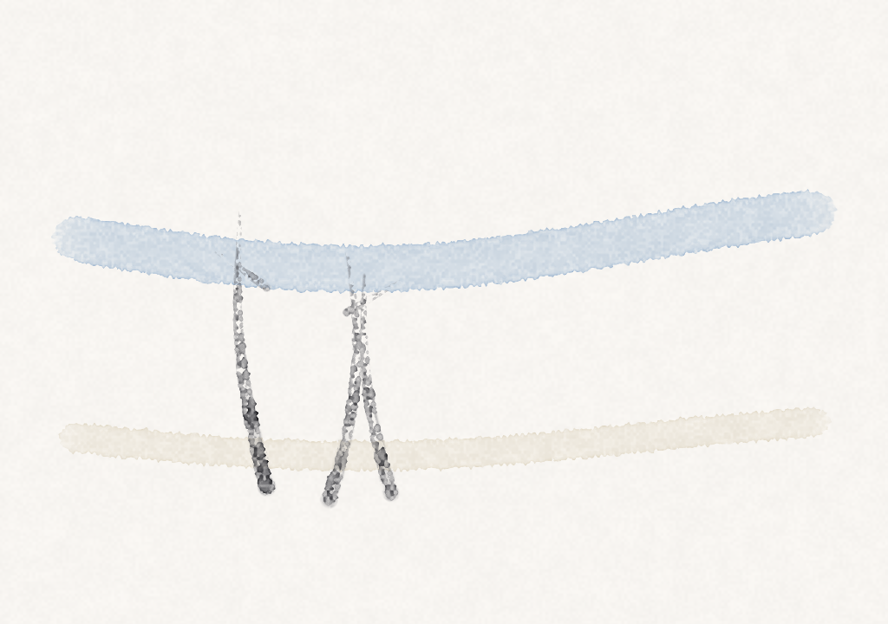
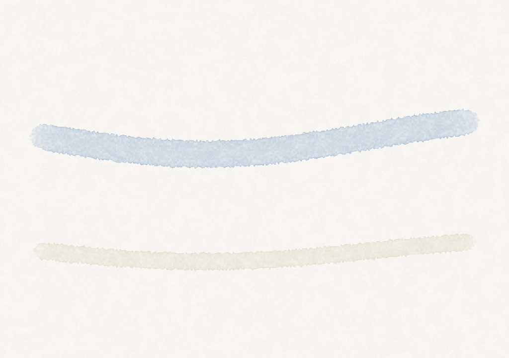
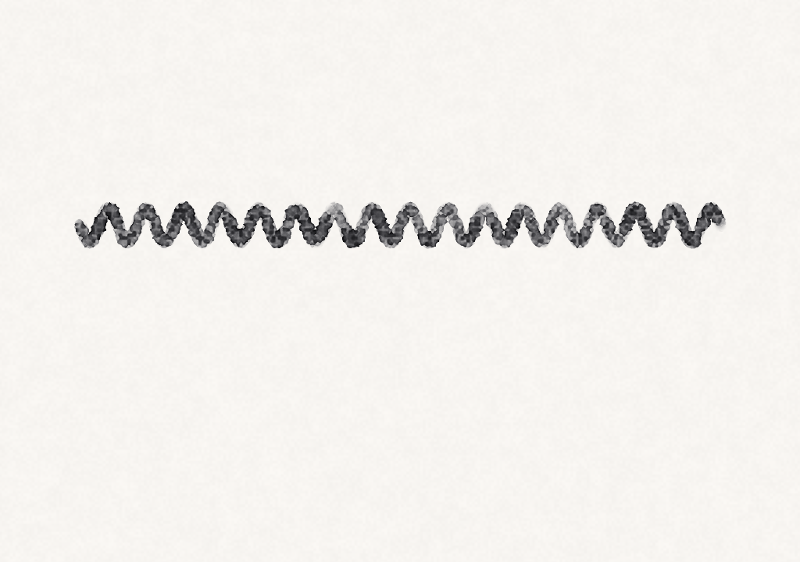
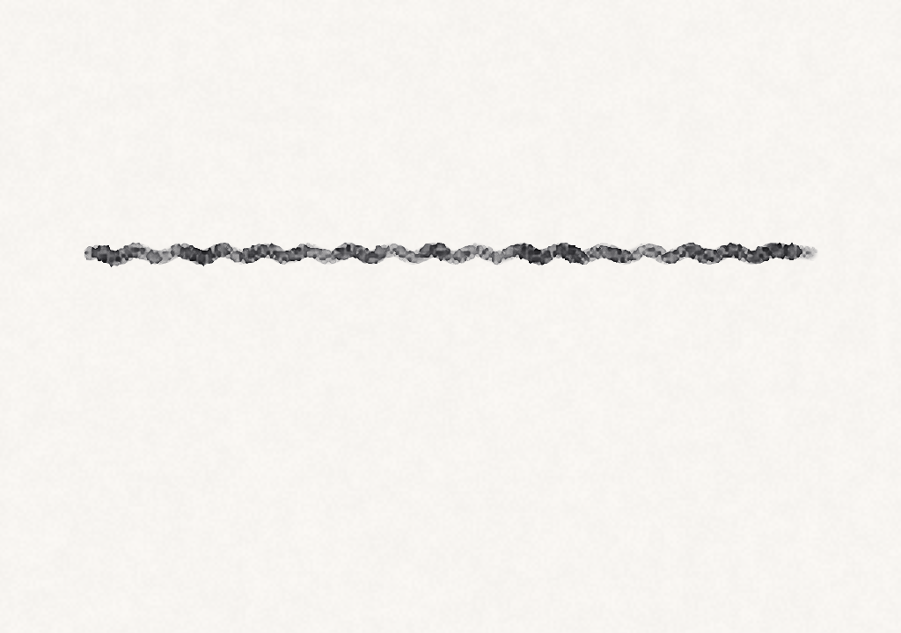
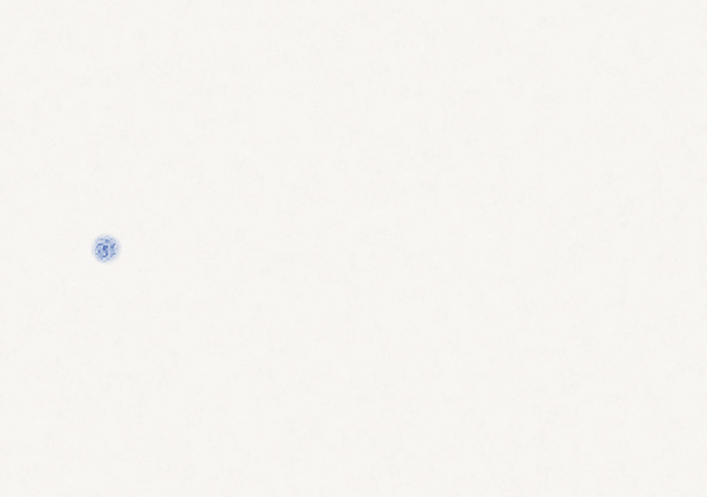

# Bloom 使い方ガイド

**雑な線が、水彩・水墨のような「良い感じ」の絵になる** macOS ネイティブの 2D 描画アプリ Bloom の使い方マニュアルです。
はじめての人が一通り使えること、そして「どう描けば良い感じになるか」のコツまでを目標にしています。

- 構想・背景は [idea.md](idea.md)、コードの現在形は [architecture.md](architecture.md) を参照。
- このガイドの操作・ショートカットは実装(`BloomApp/`)と 1:1 で対応しています。挙動が変わったら同じ PR でここも更新します。

---

## 目次

0. [このアプリについて / 画面の見方](#0-このアプリについて--画面の見方)
1. [はじめての一筆(クイックスタート)](#1-はじめての一筆クイックスタート)
2. [ブラシを使い分ける](#2-ブラシを使い分ける)
3. [色と濃さ・サイズ](#3-色と濃さサイズ)
4. [描き味のコツ(レシピ)](#4-描き味のコツレシピ)
5. [レイヤーで重ねる](#5-レイヤーで重ねる)
6. [取り消し・保存・書き出し](#6-取り消し保存書き出し)
7. [アニメーションを作る](#7-アニメーションを作る)
8. [ショートカット & メニュー早見表](#8-ショートカット--メニュー早見表)
9. [困ったとき(トラブルシュート)](#9-困ったときトラブルシュート)

---

## 0. このアプリについて / 画面の見方

Bloom は、**ストローク自体が本物の水彩・墨のように振る舞う**(滲み・かすれ)ことと、**手ブレ補正などの軽い補助**で、上手く描く技術がなくてもそれらしい絵になることを狙った描画ソフトです。

- **ペンタブの筆圧**があれば一番気持ちよく描けますが、**マウスでも描けます**(カーソルの速度から擬似的な筆圧を作ります)。
- まだ配布用バイナリはありません。**ソースから起動**します(`make run` / Xcode)。手順は [README](../README.md) を参照。

### 画面の構成

通常起動すると、**中央キャンバス + 右インスペクタ + 下タイムライン + 最下部ステータスバー**の固定レイアウトになります。

- **中央キャンバス**: ドラッグで描く場所。
- **右インスペクタ**: ブラシ・色・サイズ・水量・手ブレ補正・レイヤーの設定(下記各節)。
- **下タイムライン**: フレーム(アニメ)の選択・再生・追加など([§7](#7-アニメーションを作る))。
- **最下部ステータスバー**: 現在のブラシ名・半径・筆圧などの情報。

> 上のスクリーンショットはタイムライン追加時のもので、**インスペクタの「手ブレ」スライダ(M3 で追加)は写っていません**。実際にはサイズ/水量スライダのそばに並びます([§4](#4-描き味のコツレシピ))。

---

## 1. はじめての一筆(クイックスタート)

1. アプリを起動する(`make run`)。
2. キャンバスを**ドラッグ**する。線が引かれ、**じわっと滲んで**いきます。
3. 数秒待つと**乾いて**、縁に顔料が溜まった水彩らしい濃淡が残ります。
4. やり直したくなったら **`c`** でキャンバスをクリア、または **Cmd+Z** で 1 ストロークずつ取り消し。

最初は既定の**水彩(藍)**ブラシです。マウスなら、**ゆっくり**動かすと太く濃く、**速く**動かすと細くなります(擬似筆圧)。

> 入力に困らないための予備キー: **`d`** を押すとデモストロークが自動で描かれ、滲み具合を確認できます。

---

## 2. ブラシを使い分ける

ブラシは 2 本。インスペクタ上部の切り替え、またはキーで選びます。

| キー | ブラシ | 性格 |
|---|---|---|
| `1` | **水彩(藍)** | たっぷりの水で**滲む**。やわらかいウォッシュ向き |
| `2` | **墨(かすれ)** | 水が少なく**かすれる**(ドライブラシ)。線・アクセント向き |

### 筆圧で変わるもの

タブレットの筆圧、またはマウスの擬似筆圧で、次が連動して変わります。

- **太さ(半径)**: 強いほど太い。水彩は 5.5〜22pt、墨は 2〜14pt 程度。
- **水量**: 強いほど水が多く、よく滲む。
- **顔料の濃さ**: 強いほど濃い。
- **かすれ(墨のみ)**: **軽いタッチほどかすれが強く**なります。入り・抜きや、速いマウス払いで自然にかすれます。

上の図は同じ墨ブラシを筆圧違いで描いたもの。**高圧=ほぼ繋がる / 低圧=全体に割れる / 払い(高→低圧)=右へかすれが育つ**、という挙動です。

> マウスの擬似筆圧は**カーソル速度**から作られます(速い=軽い)。つまりマウスでも「速く払う」とかすれます。タブレットなら実際の筆圧がそのまま効きます。

---

## 3. 色と濃さ・サイズ

インスペクタのブラシセクションで調整します。

- **色(カラーウェル)**: 任意の色を選べます(sRGB の顔料色)。水彩の既定は藍、墨は黒。
- **サイズ**: スライダ(4〜80pt)、またはキー **`[`**(細く)/ **`]`**(太く)で 3pt ずつ。
- **水量**: スライダ(0〜1)。上げるほど滲みが強く、墨では**かすれが埋まって**いきます。

### 重ねると濃くなる(減法混色)

顔料は**吸光度**として扱われ、**重なると吸光度が加算**されます。つまり同じ場所を塗り重ねると濃くなり、違う色を重ねると**絵の具を混ぜたように**暗く濁った色になります(加法的に明るくはなりません)。薄く何度も重ねて濃さを作る、という水彩的な使い方ができます。

---

## 4. 描き味のコツ(レシピ)

「雑な線を良い感じにする」ための、効かせどころです。

### 滲みを活かす(水彩)

- **ゆっくり・水量多め**で描くと、よく広がってやわらかいウォッシュになります。
- **筆を止めて置きっぱなし**にすると、その場に水と顔料が溜まり続け(ドウェル)、**乾くと縁が濃い輪っか(ブルーム)**になります。水彩らしい味です。

| 置いて溜めた直後 | 乾いてブルームが出た |
|---|---|
|  |  |

### かすれを出す(墨)

- **軽く・速く**動かすほどかすれます(擬似筆圧/筆圧が下がる → かすれ増加)。
- **水量を下げる**と、よりパサっと割れます。逆に水量を上げると埋まって繋がります。
- 入り・抜きで自然に筆圧が抜けるので、**払い**は勝手にかすれます([§2 の図](#2-ブラシを使い分ける))。

### 線を整える(手ブレ補正)

手の震えやマウスのガタつきを吸収します。インスペクタの**「手ブレ」スライダ**(0=オフ 〜 1=最強)で強さを決めます。ブラシに依存しない**入力全体の設定**です。

| 補正なし(0) | 補正あり(0.85) |
|---|---|
|  |  |

- 高周波の揺れだけ吸収し、**意図した動き(大きく曲げる等)はそのまま**通します。
- 補正するのは**位置だけ**で、筆圧はいじりません。強くしすぎると線が少し遅れて付いてくる感覚になります。

---

## 5. レイヤーで重ねる

インスペクタのレイヤーリストで、複数の層に分けて描けます。

- **＋ / 🗑**: レイヤーの追加 / 削除。
- **👁 アイコン**: 表示 / 非表示の切り替え。
- **行をクリック**: その層を**アクティブ**(描き込み先)にする。
- **行をドラッグ&ドロップ**: 重なり順を入れ替える(上の行が手前)。
- **不透明スライダ**: 選択中の層の不透明度(0〜1)。

| 2 層を重ねた状態 | 順序を入れ替えた状態 |
|---|---|
|  |  |

- **順序が効きます**: 濃い(不透明寄りの)顔料は下を隠すので、上下を入れ替えると見えが変わります。薄いウォッシュ同士はほぼ順序非依存(下が透ける)。
- 注意: ウェットな顔料は**「乾いた時点でアクティブな層」**に沈着します。滲んでいる途中で層を切り替えると、残りはあとから選んだ層に乗ります。

---

## 6. 取り消し・保存・書き出し

### 取り消し / やり直し

- **取り消す = Cmd+Z**、**やり直す = Cmd+Shift+Z**。
- 取り消し単位は、1 ストローク・クリア・レイヤー操作・フレーム操作です(選択や表示切り替えは履歴に積みません)。

| 取り消す前 | 取り消した後(空に戻る) |
|---|---|
|  |  |

### ドキュメント保存(`.bloom`)

- **保存 = Cmd+S**、**別名で保存 = Cmd+Shift+S**、**開く = Cmd+O**。
- `.bloom` は**乾いた絵そのもの**(全レイヤー・全フレームの顔料)を保存するラスタ形式です。途中の濡れ具合やストローク履歴は持ちません。

### 画像・アニメの書き出し(ファイルメニュー)

| 書き出し | ショートカット | 内容・用途 |
|---|---|---|
| **PNG** | Cmd+E | 現在フレーム 1 枚の画像 |
| **GIF** | Cmd+G | 全フレームのアニメ GIF(12fps) |
| **スプライトシート** | Cmd+Shift+G | 全フレームを格子状に並べた 1 枚 PNG + `.json` メタ(フレーム寸法・枚数・列数)。**Unity / Unreal でスライス**して使えます |
| **PNG 連番** | (メニューから) | `frame_0001.png …` を書き出し |

---

## 7. アニメーションを作る

下のタイムラインでフレームアニメを作れます。

- **フレーム帯**: クリックでそのフレームへ移動。現在フレームは強調表示。
- **▶ / ⏸**(または **Cmd+P**): 再生 / 停止。**◀ / ▶**(Cmd+, / Cmd+.): 前後送り。
- **＋ 新規フレーム**(Cmd+Shift+N): 後ろに空フレームを追加。
- **⧉ 複製**(Cmd+Shift+D): 現在フレームを複製。
- **🗑 削除**: 現在フレームを削除。
- **fps**: 再生速度(既定 12)。プレビュー再生のテンポを決めます(GIF 書き出しは現状 12fps 固定)。

### セル方式(hold)

レイヤー(トラック)はフレームをまたいで存在し、**各フレームに「セル(原画)」を持つかどうか**で動きます。

- セルの無いフレームは**直前のセルを保持(hold)**します。だから**動かない背景はセル 1 枚で全フレームに効きます**。
- 保持中のフレームに描き込むと、その場に**新しいセル(新しい原画)**ができます。

### オニオンスキン

タイムラインの**「オニオン」**にチェックを入れると、**前フレームが薄く透けて**見えます(現フレームがまだ描かれていない所に暖色で)。中割りの目安になります。書き出し時は自動で無効になります。

| オニオン表示(前フレームのゴースト) | 動く作例(GIF) |
|---|---|
|  |  |

---

## 8. ショートカット & メニュー早見表

### キャンバス上のキー

| キー | 動作 |
|---|---|
| `1` | 水彩(藍)ブラシ |
| `2` | 墨(かすれ)ブラシ |
| `[` / `]` | ブラシを細く / 太く(±3pt) |
| `c` | キャンバスをクリア |
| `d` | デモストロークを描く |

### メニュー

| メニュー | 項目 | ショートカット |
|---|---|---|
| **ファイル** | 開く… | Cmd+O |
| | 保存 | Cmd+S |
| | 別名で保存… | Cmd+Shift+S |
| | PNG を書き出す… | Cmd+E |
| | GIF を書き出す… | Cmd+G |
| | スプライトシートを書き出す… | Cmd+Shift+G |
| | PNG 連番を書き出す… | — |
| **編集** | 取り消す | Cmd+Z |
| | やり直す | Cmd+Shift+Z |
| **フレーム** | 新規フレーム | Cmd+Shift+N |
| | フレームを複製 | Cmd+Shift+D |
| | フレームを削除 | — |
| | 前のフレーム / 次のフレーム | Cmd+, / Cmd+. |
| | 再生 / 停止 | Cmd+P |
| **アプリ** | Quit Bloom | Cmd+Q |

---

## 9. 困ったとき(トラブルシュート)

- **筆圧が効かない(タブレット)**: ① ドライバ(XPPEN/Wacom 等)を起動しているか、② macOS の「プライバシーとセキュリティ」で**アクセシビリティ + 入力監視**をドライバに許可しているか、を確認。ドライバが無いと OS からはただのマウスに見え、筆圧・チルトは取れません。詳細は [idea.md の入力ハードウェア節](idea.md)。
- **マウスだと細さが安定しない**: 擬似筆圧は**速度**で決まります。一定の速さで動かすと安定します。線を整えたいときは[手ブレ補正](#4-描き味のコツレシピ)を上げてみてください。
- **ビルドで `cannot execute tool 'metal'`**: Xcode 26 以降は Metal ツールチェーンが別コンポーネントです。`xcodebuild -downloadComponent MetalToolchain` を実行。
- **読み込みでサイズ不一致エラー**: `.bloom` はキャンバス寸法の一致を検証します。別サイズで作ったドキュメントは現在の固定サイズのキャンバスには読み込めません。
- そのほかの既知のハマりどころは [architecture.md のハマりどころ](architecture.md#ハマりどころ再発時のために) を参照。

---

*このガイドは実装に追従して更新されます。機能の追加・変更があったら、同じ PR でここも直してください。*
